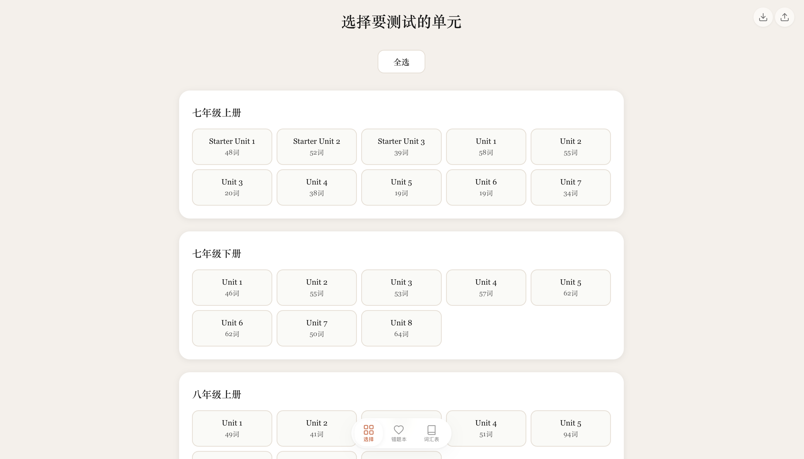
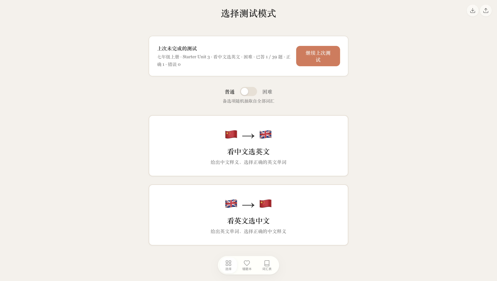
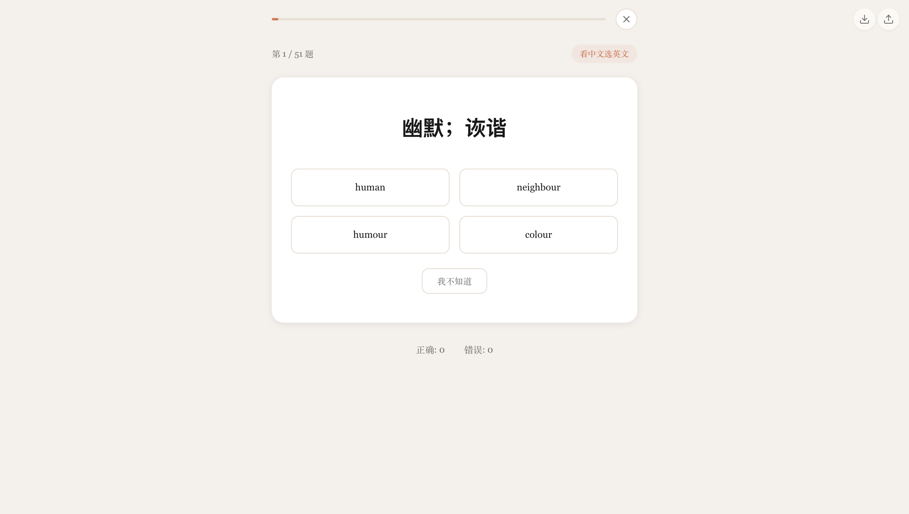

# 📚 英语单词学习应用


一个类似百词斩的网页端英语单词学习应用，基于 React + TypeScript + Vite 构建。

> **👉 [点击这里直接在线使用](https://henry1786580051-lang.github.io/english-test/)**，无需安装任何软件，打开即用。

<p align="center">
  
  
</p>
<p align="center">
  
</p>

## 📑 目录

- [功能特点](#-功能特点)
- [快速开始](#-快速开始)
- [使用说明](#-使用说明)
- [技术栈](#️-技术栈)
- [数据来源](#-数据来源)
- [项目结构](#-项目结构)
- [贡献](#-贡献)
- [许可证](#-许可证)

## 🌟 功能特点

### 📖 核心功能
- **🎯 词库管理**：包含初中英语课本（七年级上下册、八年级上下册、九年级全一册）的完整单词库
- **📝 测试模式**：
  - 🔤 看中文选英文：给出中文释义，从四个选项中选出对应英文单词
  - 🔡 看英文选中文：给出英文单词，从四个选项中选出对应中文释义
- **📂 Unit 选择**：支持选择单个 Unit、多个 Unit 或全部 Unit 进行测试
- **❌ 错题本**：记录每个 Unit 内答错的单词，支持用户专项复习错题
- **📊 成绩统计**：每轮测试结束后显示本次正确率及错误单词列表

### ✨ 交互动效
- ✅ 答对：绿色高亮 + 轻微弹跳动画，短暂停留后自动进入下一题
- ❌ 答错：红色高亮错误选项 + 绿色高亮正确答案 + 轻微抖动动画，显示正确答案后继续

### 🎨 界面设计
- 🃏 简洁现代的卡片式设计
- 📱 响应式布局，适配桌面端浏览器
- 🎨 采用 Claude 风格暖色调配色方案（#DA7756 陶土橙为主色），温馨舒适

## 🚀 快速开始

> 💡 **不想折腾？** 可以直接 [在线使用](https://henry1786580051-lang.github.io/english-test/)，无需安装。

<details>
<summary><strong>🍎 macOS 安装步骤</strong></summary>

#### 第一步：安装 Node.js

1. 打开 **Safari**，访问 [Node.js 官网](https://nodejs.org/)
2. 下载 **LTS（长期支持版）** 安装包（`.pkg` 文件）
3. 双击安装包，按提示完成安装
4. 打开 **终端**（启动台 → 搜索「终端」或「Terminal」），输入：
   ```bash
   node -v
   ```
   看到类似 `v20.x.x` 的版本号即表示安装成功

#### 第二步：安装 pnpm

```bash
npm install -g pnpm
```

#### 第三步：安装 Git

macOS 通常自带 Git。在终端输入 `git --version`，如果提示安装开发者工具则按提示安装即可。

#### 第四步：下载并运行项目

```bash
git clone https://github.com/henry1786580051-lang/english-test.git
cd english-test
pnpm install
pnpm dev
```

> 首次安装可能需要 1-3 分钟。如果安装失败，可以尝试设置国内镜像源：
> ```bash
> pnpm config set registry https://registry.npmmirror.com
> pnpm install
> ```

终端会显示 `http://localhost:5173/`，在浏览器中打开即可使用。按 `Ctrl + C` 可停止服务器。

</details>

<details>
<summary><strong>🪟 Windows 安装步骤</strong></summary>

#### 第一步：安装 Node.js

1. 打开浏览器，访问 [Node.js 官网](https://nodejs.org/)
2. 下载 **LTS（长期支持版）** 安装包（`.msi` 文件）
3. 双击安装包，按提示一路「Next」完成安装
4. 按 `Win + S`，搜索 **PowerShell** 并打开，输入：
   ```bash
   node -v
   ```
   看到类似 `v20.x.x` 的版本号即表示安装成功

#### 第二步：安装 pnpm

```bash
npm install -g pnpm
```

#### 第三步：安装 Git

1. 访问 [Git 官网](https://git-scm.com/)，下载 Windows 版安装包
2. 双击安装，按提示完成（全部默认选项即可）
3. 安装完成后重新打开 PowerShell，输入 `git --version` 验证

#### 第四步：下载并运行项目

```bash
git clone https://github.com/henry1786580051-lang/english-test.git
cd english-test
pnpm install
pnpm dev
```

> 首次安装可能需要 1-3 分钟。如果安装失败，可以尝试设置国内镜像源：
> ```bash
> pnpm config set registry https://registry.npmmirror.com
> pnpm install
> ```

终端会显示 `http://localhost:5173/`，在浏览器中打开即可使用。按 `Ctrl + C` 可停止服务器。

</details>

### 🔨 构建生产版本（可选）

```bash
pnpm build
```

构建产物输出到 `dist/` 目录，可部署到任何静态托管服务。

## 📖 使用说明

1. **📂 选择单元**：在首页选择要测试的单元，可以点击"全选"按钮选择所有单元
2. **🚀 开始测试**：选择完单元后点击"开始测试"按钮
3. **✍️ 答题**：根据题目选择正确答案
4. **📈 查看结果**：测试完成后会显示正确率和错误单词列表
5. **❌ 错题本**：可以点击导航栏的"错题本"查看所有答错的单词
6. **🔄 再次测试**：可以点击"再次测试"重新测试当前单元，或点击"返回选择"选择其他单元

## 🛠️ 技术栈

| 技术 | 用途 |
|------|------|
| [React 19](https://react.dev/) | UI 框架 |
| [TypeScript](https://www.typescriptlang.org/) | 类型安全 |
| [Vite 8](https://vite.dev/) | 构建工具 |
| CSS3 | 样式与动画 |

## 📚 数据来源

目前词库全部基于**人教版（PEP）初中英语课本**，共涵盖 5 册教材、约 2200+ 个单词：

| 册次 | 状态 |
|------|------|
| 📗 七年级上册 | ✅ 已收录 |
| 📘 七年级下册 | ✅ 已收录 |
| 📙 八年级上册 | ✅ 已收录 |
| 📕 八年级下册 | ✅ 已收录 |
| 📒 九年级全一册 | ✅ 已收录 |

> 💡 如果有更多课本词汇的需求（如高中、小学或其他版本教材），欢迎提交 Issue 反馈。

课本 PDF 资源来自开源项目 [ChinaTextbook](https://github.com/TapXWorld/ChinaTextbook)，感谢该项目提供的教材数据支持。

## 📁 项目结构

```
src/
├── components/          # 组件目录
│   ├── UnitSelector.tsx    # 单元选择组件
│   ├── TestMode.tsx        # 测试模式组件
│   ├── TestResult.tsx      # 测试结果组件
│   └── WrongWords.tsx      # 错题本组件
├── data/               # 数据目录
│   └── words.json          # 单词数据
├── styles/             # 样式目录
│   └── App.css             # 应用样式
├── types/              # 类型定义目录
│   └── index.ts            # TypeScript 类型定义
├── App.tsx             # 主应用组件
├── main.tsx            # 应用入口
└── index.css           # 全局样式
```

## 🤝 贡献

欢迎提交 Issue 和 Pull Request！

1. Fork 本仓库
2. 创建你的功能分支 (`git checkout -b feature/amazing-feature`)
3. 提交你的改动 (`git commit -m 'feat: add amazing feature'`)
4. 推送到分支 (`git push origin feature/amazing-feature`)
5. 提交 Pull Request

## 📄 许可证

[MIT License](LICENSE)
